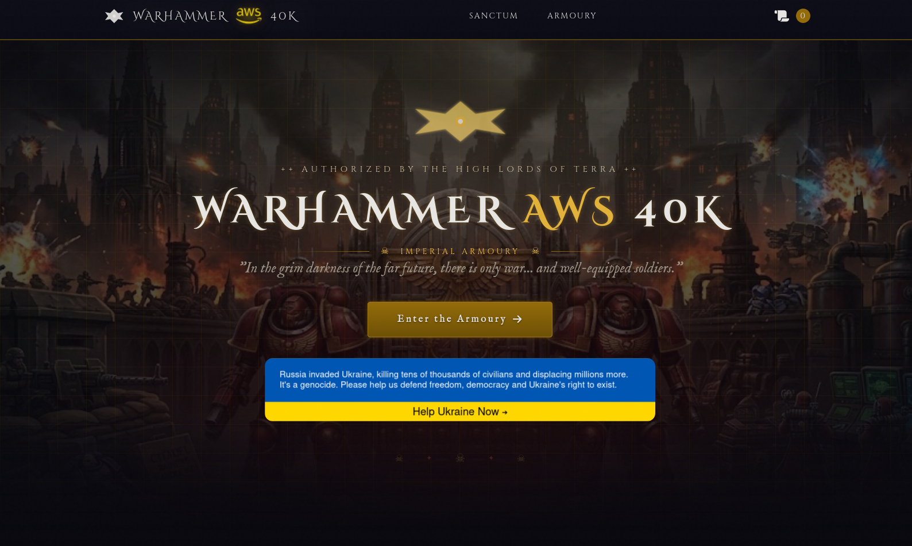

# AWS Platform for Retail Store Sample App

This repository contains the AWS infrastructure, deployment automation, Kubernetes platform add-ons, and image build sources used to run the Retail Store Sample App in this environment.

## Overview

The current setup provisions and operates:

- An Amazon VPC with public and private subnets, Internet Gateway, route tables, and NAT Gateway egress
- One Amazon EKS cluster per environment (`staging`, `production`)
- Amazon ECR repositories for `frontend`, `catalog`, `checkout`, and `aiops`
- CloudFront in front of the storefront origin
- ACM certificates for the public entrypoints
- Cloudflare-managed DNS records and ACM DNS validation
- Argo CD and Kubernetes platform add-ons
- Velero backups to S3
- A separate AIOps service on Amazon ECS Fargate behind its own ALB

## Tech Stack

| Layer | Stack |
|---|---|
| Cloud | AWS VPC, EKS, ECR, CloudFront, ACM, KMS, S3, ECS Fargate, ALB, NLB, Systems Manager Parameter Store |
| DNS and certificates | Cloudflare DNS, ACM DNS validation |
| Infrastructure as Code | Terraform |
| CI/CD | GitHub Actions, GitHub OIDC to AWS |
| Kubernetes delivery | Argo CD, Helm |
| Platform add-ons | AWS Load Balancer Controller, ExternalDNS, Cluster Autoscaler, Sealed Secrets, Kyverno, Velero |
| Observability | kube-prometheus-stack, Grafana, Alertmanager |
| Application images | UI, Catalog, Checkout, AIOps |
| Upstream application source | `aws-containers/retail-store-sample-app` |

## Architecture

### Core AWS platform

- Terraform creates the VPC, subnets, Internet Gateway, NAT Gateway, security groups, IAM roles, EKS, ECR, CloudFront, ACM, Velero S3 storage, and the ECS-based AIOps service.
- The EKS control plane is configured with private endpoint access enabled and secrets encryption through a dedicated KMS key.
- EKS worker nodes run as a managed node group in private subnets, using a custom launch template with encrypted `gp3` root volumes.
- EKS add-ons include `vpc-cni`, `coredns`, `kube-proxy`, `aws-ebs-csi-driver`, and `eks-pod-identity-agent`.

### Traffic and DNS

- The storefront is exposed from Kubernetes through an AWS Network Load Balancer with ACM TLS.
- CloudFront sits in front of the storefront origin and caches `/static/*` separately from dynamic traffic.
- DNS is managed through Cloudflare, not Route 53.
- ACM certificate validation records are also created in Cloudflare.
- Argo CD, Grafana, and AIOps each get their own public hostname and certificate flow.

### Kubernetes delivery model

- GitHub Actions authenticates to AWS using OIDC and assumes an AWS role.
- Terraform runs first for the target environment.
- Container images are then built and pushed to ECR for:
  - `src/ui`
  - `src/catalog`
  - `src/checkout`
  - `src/aiops`
- The deploy workflow installs Argo CD, applies Argo CD `Application` objects from this repo, and then applies Kyverno cluster policies.

## What Argo CD Manages

From this repository, Argo CD is used to deploy or bootstrap:

- AWS Load Balancer Controller
- ExternalDNS
- kube-prometheus-stack
- Velero
- Cluster Autoscaler
- Kyverno
- Sealed Secrets
- Retail Store application wiring and overrides

Two important sources are external:

- The `retail-store` Argo CD application pulls the upstream chart from `aws-containers/retail-store-sample-app` at `v1.4.0`.
- The `root` Argo CD application points to `https://github.com/cerobreath/aws-squad.git` and reconciles manifests from `k8s/apps`.

## Environments

The current CI/CD mapping is:

- `staging` branch -> `staging` AWS environment
- `main` branch -> `production` AWS environment

The workflows currently target `eu-central-1`. CloudFront certificates are provisioned in `us-east-1`, as required by CloudFront.

## Working With This Repo

Typical operator flow:

1. Update Terraform in `terraform/` or application/platform definitions in `k8s/` and `src/`.
2. Push to `staging` to provision or update the staging environment.
3. Validate the rollout in EKS, Argo CD, Grafana, and the public staging endpoints.
4. Promote the same changes through `main` for production.

For environment-specific Terraform values, use `terraform/envs/staging.tfvars` and `terraform/envs/production.tfvars`.

## Components

| Area | Implementation in this repo |
|---|---|
| Infrastructure as Code | Terraform in `terraform/` |
| Delivery | GitHub Actions in `.github/workflows/` |
| Kubernetes GitOps | Argo CD applications in `k8s/argocd/applications/` |
| Cluster policy | Kyverno policies in `k8s/policies/` |
| Storefront image | `src/ui/` |
| Catalog image | `src/catalog/` |
| Checkout image | `src/checkout/` |
| AIOps service | `src/aiops/` on ECS Fargate |
| Extra manifests | `k8s/apps/` plus external root repo reconciliation |

## Repository Layout

- `terraform/` - AWS infrastructure definitions and outputs
- `terraform/envs/` - environment-specific Terraform variables
- `k8s/argocd/` - Argo CD bootstrap values and application definitions
- `k8s/policies/` - Kyverno cluster policies
- `k8s/apps/` - additional Kubernetes manifests applied through the Argo CD root app
- `src/ui/` - custom storefront UI source, Dockerfile, and chart customizations
- `src/catalog/` - catalog service image source and chart assets
- `src/checkout/` - checkout service image source and chart assets
- `src/aiops/` - AIOps service source for ECS deployment
- `docs/` - screenshots and supporting documentation assets

## License

This repository is licensed under the terms in [LICENSE](LICENSE).